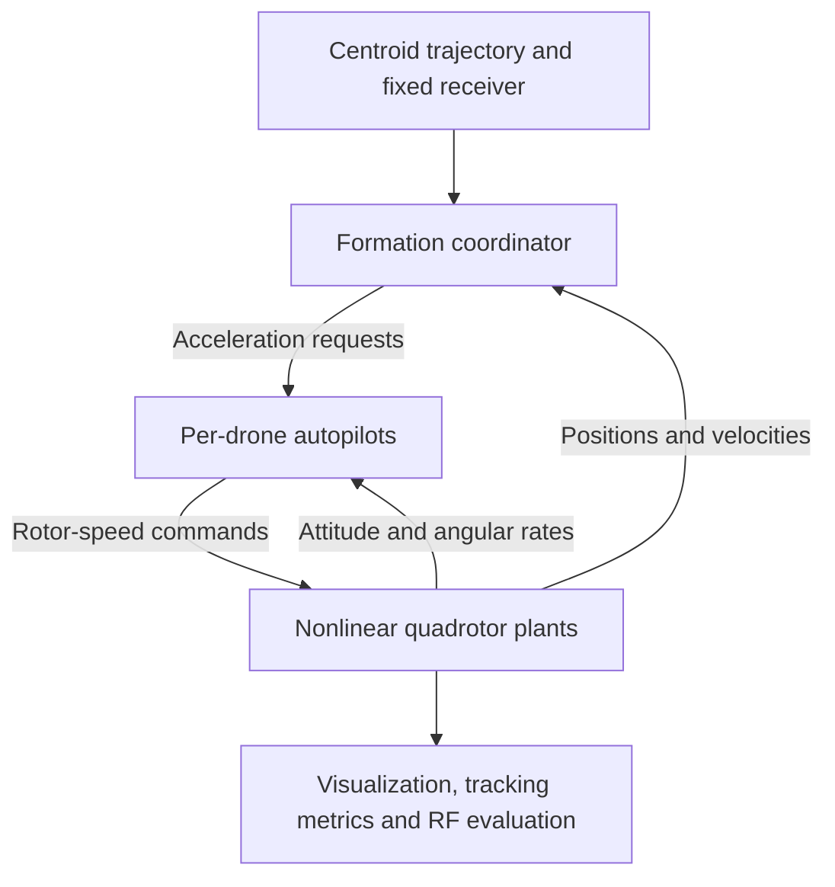

# Multi-Drone Beamforming and Formation Tracking

**MATLAB R2025a · Simulink · Nonlinear 6DOF dynamics · Formation control**

A simulation framework for moving a group of quadrotors along a prescribed trajectory while continuously orienting their antenna formation toward a fixed receiver.

The drones form the vertices of a triangle—or a larger regular polygon—and share an imaginary centroid. As the centroid follows its trajectory, the drones adjust their individual positions to rotate the formation plane. Each drone's autopilot then generates the thrust and body attitude needed to execute that motion.

The project connects geometric beam-pointing objectives to physical quadrotor dynamics, making it possible to study how formation feedback, actuator response, and disturbances affect both trajectory tracking and coherent signal transmission.


*Three-drone numerical-reference run: colored curves show actual simulated drone positions, gray triangles show formation snapshots, and red arrows show the formation normal. The elevated star marks the receiver. This figure comes from the independent Python implementation of the model equations.*

## The idea

A coherent planar antenna array has a maximum-transmission direction normal to its plane under the assumed far-field conditions. If the formation moves while its orientation remains fixed, this direction can move away from the receiver.

The objective is therefore to achieve three things simultaneously:

1. Track a prescribed trajectory with the formation centroid.
2. Maintain the desired relative geometry between drones.
3. Keep the formation normal aligned with the centroid-to-receiver direction.

**Formation orientation and drone attitude are separate quantities.** The triangle rotates because its vertices move in space. Individual drones roll and pitch as required to produce acceleration; their bodies are not commanded to lie in the triangle's plane. The centroid is a geometric reference, with no physical drone or transmitter at that point.

## What the framework includes

- Three physical quadrotors by default, with configurable regular-polygon formations.
- Smooth position, velocity, and acceleration references for figure-eight, circular, and hover missions.
- Two controller modes: geometric trajectory tracking and an adapted paper-based formation controller.
- Independent Simulink autopilots and full nonlinear rigid-body dynamics for every drone.
- Rotor thrust and reaction moments, motor lag, drag, acceleration limits, and actuator saturation.
- Optional wind disturbances and configurable transmitter phase errors.
- Live 3-D visualization, formation-error plots, RF evaluation, and exported results.

## Control architecture



The coordinator and autopilots run at **100 Hz**. Simulink integrates the continuous plant equations with a **2 ms fixed step**, while the live visualization updates at **20 Hz**.

Each vehicle has 17 state coordinates: position, world-frame velocity, a scalar-first quaternion, body angular rates, and four rotor speeds. These describe a six-degree-of-freedom rigid body with actuator dynamics. The plant evolves through forces and moments rather than directly following position setpoints.

### Geometric trajectory tracking

Let $c_d(t)$ be the desired centroid, $p_R$ the receiver position, and $\rho_i$ a fixed vertex offset in the formation frame. The desired normal is

$$
n_d(t)=\frac{p_R-c_d(t)}{\|p_R-c_d(t)\|}.
$$

A smooth rotation $R_d(t)$ is constructed such that $R_d e_3=n_d$. Each drone receives the reference

$$
p_{i,d}=c_d+R_d\rho_i,\qquad
v_{i,d}=\dot c_d+\dot R_d\rho_i,\qquad
a_{i,d}=\ddot c_d+\ddot R_d\rho_i.
$$

These derivatives include the motion caused by formation rotation. Position and velocity feedback then produce an acceleration request:

$$
a_i^*=a_{i,d}+K_p(p_{i,d}-p_i)+K_d(v_{i,d}-v_i).
$$

### Paper-based formation control

The second mode estimates the actual formation orientation from labelled drone positions and combines rotation feedback, centroid tracking, and pairwise-distance control.

For each constrained pair,

$$
q_{ij}=\|p_i-p_j\|^2-d_{ij}^2,\qquad \dot q=2Jv.
$$

Using the rigidity matrix $J$, the controller retains the paper's backstepping structure:

$$
v_f=v_d-k_vJ^Tq,
$$

$$
u=-k_a(v-v_f)-k_qJ^Tq-k_v\dot J^Tq-2k_vJ^TJv+\dot v_d.
$$

The reference velocity field $v_d$ combines centroid motion and formation rotation. The resulting acceleration request feeds the drone's thrust-and-attitude autopilot.

The implementation adds absolute centroid feedback, normalizes complete-graph shape gains by $3/N$, and damps out-of-plane deformation for formations larger than three drones. These are explicit adaptations of the original method. Full derivations and a paper-to-code comparison are provided in [Mathematics](docs/MATHEMATICS.md).

## Simulation scenario

| Parameter | Default value |
|---|---|
| Physical drones | 3 |
| Formation | Equilateral triangle, 0.8 m circumradius |
| Centroid trajectory | Smooth figure-eight with a 5 s start-from-rest ramp |
| Nominal centroid altitude | 3 m, with a 0.35 m vertical excursion |
| Fixed receiver | $(4,-3,15)$ m |
| Simulation duration | 60 s |
| Initial centroid displacement | $(0.15,-0.10,0.10)$ m |
| Initial formation rotation error | 12° about the world y-axis |
| Vehicle mass / arm radius | 1 kg / 0.225 m |
| Motor time constant | 25 ms |
| RF carrier / power per drone | 138 MHz / 0.1 W |

The vehicles begin airborne. The nonzero initial displacement and rotation make the convergence behavior visible before sustained trajectory tracking.

## Results

The figures and values below are from **independent numerical-reference simulations of the equations in Python**. They provide a reproducible comparison of the model and controller behavior; they are not exports from the MATLAB/Simulink run or measurements from physical drones. The corresponding records are included in [`validation/`](validation/).


Each case runs for 60 s with the same initial centroid and formation-orientation errors. “Settled pointing RMSE” uses samples from 10 s onward; centroid and edge RMSE include the initial transient.

| Controller | Drones | Wind | Centroid RMSE | Settled pointing RMSE | Edge-length RMSE | Minimum separation |
|---|---:|---|---:|---:|---:|---:|
| Geometric | 3 | Off | 2.90 cm | 0.0126° | 1.551 mm | 1.369 m |
| Paper-based | 3 | Off | 2.89 cm | 0.0095° | 0.344 mm | 1.381 m |
| Paper-based | 6 | Off | 2.89 cm | 0.0095° | 0.310 mm | 0.797 m |
| Paper-based | 3 | On | 4.73 cm | 0.1603° | 0.344 mm | 1.381 m |

### What the results show

- **Both controllers recover from the initial error.** Pointing error falls from approximately 12° and remains small along the supplied slow trajectory.
- **Distance feedback improves shape preservation in this comparison.** The three-drone paper-based controller reduces edge-length RMSE by approximately 78% relative to the geometric baseline, with similar centroid RMSE.
- **The six-drone case remains well behaved with normalized gains.** At the same circumradius, its smaller minimum separation follows from packing more vertices around the polygon.
- **Wind affects tracking more than relative shape.** The modeled disturbance increases centroid and pointing errors, while pairwise-distance errors remain similar. The simple autopilot has no position integral action.
- **No acceleration limiting or rotor-command saturation was recorded in these four cases.** Minimum separation remained above the configured 0.54 m vehicle-envelope threshold.

These results use exact state feedback and idealized vehicle parameters. Their small errors characterize these simulation conditions, not expected hardware accuracy. Verification details and unrounded results are in [Validation](docs/VALIDATION.md) and [`numerical_validation.json`](validation/numerical_validation.json).

## Beamforming evaluation

RF performance is evaluated from the **actual drone positions**, so geometric tracking errors affect the computed received signal. For range $d_i$, transmitter phase offset $\phi_i$, wavelength $\lambda$, and per-drone transmit power $P_t$,

$$
A_i=\sqrt{P_t}\frac{\lambda}{4\pi d_i},\qquad
P_r=\left|\sum_{i=1}^{N}A_i e^{j\phi_i-j2\pi d_i/\lambda}\right|^2.
$$

The model reports received SNR and coherent combining loss relative to the bound $(\sum_i A_i)^2$. A fixed-orientation formation at the same instantaneous centroid provides a communication comparator, and a final far-field array-factor slice illustrates the angular pattern.

Coherent transmission assumes synchronized carriers and ideal isotropic antennas. Geometry alone cannot compensate for arbitrary independent carrier-phase errors. A planar array has broadside maxima along both opposite normals; for a nonplanar deformed array, the best-fit normal is a geometric pointing measure rather than an optimized radiation maximum.

## Visualization and recorded metrics

During simulation, the live view displays drone bodies and trajectories, desired and actual formation polygons, the virtual centroid, the fixed receiver, and the pointing geometry. Companion plots track normal alignment, centroid error, and shape error.

Each run also exports position and pointing RMSE, maximum edge error, minimum separation, planarity error, vehicle speed and tilt, saturation statistics, quaternion-norm error, and RF metrics. MATLAB data, CSV summaries, and PNG plots are saved under `results/<mode>_N<N>/`.

## Run a demonstration

Requires **MATLAB R2025a and Simulink**. From the project folder:

```matlab
startup_project
result = run_demo;         % Generate the Simulink model and run the live demo
```

Use `run_tests(true)` for equation and Simulink checks, or `run_comparison` to compare both controller modes. Scenario parameters, drone count, wind, vehicle properties, and gains are configured in `config_default.m`.

## Repository guide

| Path | Purpose |
|---|---|
| `core/` | Reference generation, formation control, autopilot, dynamics and metrics |
| `simulink/` | Simulink block adapters for controllers, plants and live visualization |
| `visualization/` | Live graphics, result plots and replay |
| `tests/` | MATLAB equation checks and Simulink integration checks |
| `validation/` | Independent numerical implementation, recorded results and figures |
| `docs/` | Mathematical derivations and validation details |
| `build_model.m` | Generates the complete Simulink model |
| `config_default.m` | Central scenario and model configuration |

## Scope and future work

This is an airborne formation-tracking demonstrator with centralized, perfect state feedback. It does not yet model state-estimation errors, communication delays, downwash interactions, obstacles, ground contact, or takeoff and landing. Separation is monitored; there is no online collision-avoidance controller.

The original paper's local stability result for point-mass agents does not automatically extend to this sampled, saturated quadrotor system. The implementation is a research adaptation with explicit numerical validation, rather than a claim of unchanged theoretical guarantees.

Natural extensions include identified vehicle parameters, noisy mocap or onboard state estimates, delayed inter-drone communication, constrained trajectory generation, improved actuator allocation, and hardware experiments that evaluate both motion tracking and RF coherence.

## Research reference

Bharat Manvi, Bharath Bhikkaji, and Arun D. Mahindrakar. **Simultaneous beamforming and trajectory tracking in a multi-agent formation.** 2021 29th Mediterranean Conference on Control and Automation (MED), pp. 1114–1119.

[DOI: 10.1109/MED51440.2021.9480277](https://doi.org/10.1109/MED51440.2021.9480277)
