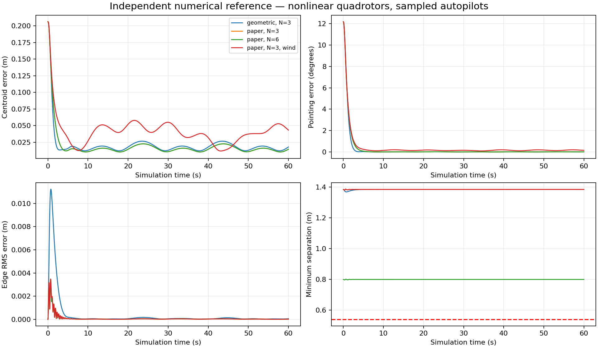
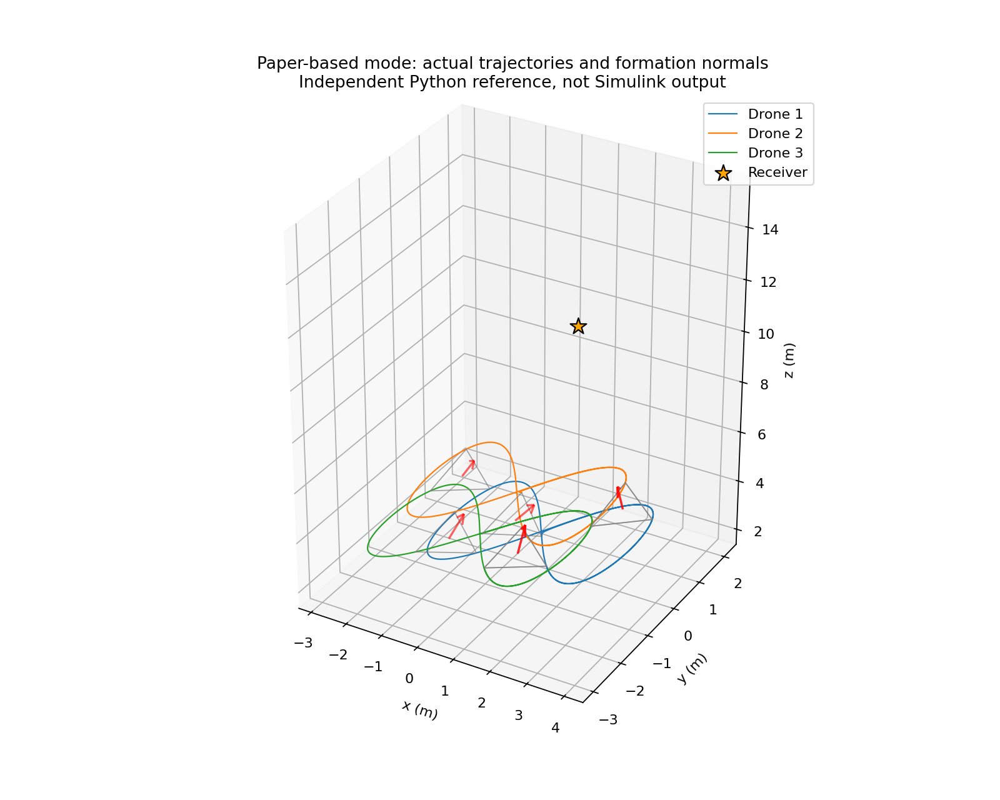

# Validation status and local acceptance checks

## What was executed in the authoring environment

MATLAB and Simulink were not installed. No `.m` function or generated `.slx` was
executed there. The package includes a reproducible R2025a model builder, not an
untested fabricated binary model. The distinction below is deliberate.

1. All MATLAB source files were parsed with the tree-sitter MATLAB grammar.
   See `validation/matlab_syntax_check.json` for the final count and result.
2. The geometry, reference derivatives, feedback, sampled autopilot and full
   nonlinear rotor/rigid-body dynamics were independently implemented in
   `validation/numerical_reference.py` using NumPy/SciPy.
3. Four 60 s cases were integrated with 2 ms RK4 steps, held 100 Hz controller
   commands and 50 Hz logging: both modes with three drones, paper-based mode
   with six drones, and paper-based mode with wind.
4. Analytic velocity and acceleration references were compared with central
   finite differences. Maximum component discrepancies were below 3e-10 in the
   tested points. The polar-factor rotation derivative was tested under shape
   and velocity perturbations, with maximum discrepancy below 5e-12.
5. The generated previews and numerical records were inspected. Complete-graph
   shape gains were normalized by 3/N after an initial six-drone check revealed
   excessive correction demands. All evidence below uses the final normalization.

**These are independent numerical-reference results, not MATLAB/Simulink results.**
They support the equations and default tuning, but cannot establish that every
Simulink block parameter/callback works in R2025a. The included local tests are
needed for that final integration gate. Grammar parsing is not MATLAB execution
or semantic verification.

## Independent numerical results

All cases include the default initial centroid offset and 12-degree formation
rotation. The settled metric excludes the first 10 seconds. Noise-free state
feedback and ideal radio coherence apply. Values describe the supplied scenarios;
they are not performance guarantees for arbitrary missions or real drones.

| Case | Centroid RMSE (cm) | Settled pointing RMSE (deg) | Edge RMSE (mm) | Minimum separation (m) | Accel / motor saturation |
|---|---:|---:|---:|---:|---:|
| geometric, N=3 | 2.900 | 0.0126 | 1.551 | 1.3693 | 0.0% / 0.0% |
| paper, N=3 | 2.885 | 0.0095 | 0.344 | 1.3809 | 0.0% / 0.0% |
| paper, N=6 | 2.885 | 0.0095 | 0.310 | 0.7969 | 0.0% / 0.0% |
| paper, N=3 + wind | 4.731 | 0.1603 | 0.344 | 1.3810 | 0.0% / 0.0% |

Maximum quaternion-norm errors were below 4e-12 across these runs. The six-drone
maximum best-fit planarity RMS was about 0.124 mm. The small errors are expected
for a slow path, exact state feedback and an idealized generic plant; they should
not be interpreted as experimental hardware accuracy.

`numerical_validation.json` holds unrounded summaries. Each `.npz` contains all
logged physical states and numerical metric histories, and each corresponding
CSV is readable without Python. The CSV column names identify their units.
The Python validation uses the same documented model choices but is a separate
implementation and therefore cannot detect all transcription/API errors in `.m`.





## Required local check in MATLAB R2025a

From the project directory:

```matlab
startup_project
run_tests(true)
check_engine_agreement
result = run_demo;
```

`run_tests(true)` exercises the actual MATLAB source and then builds/compiles/runs
both controller modes plus a six-drone case with nonplanar initial perturbations.
The equation assertions cover:

- R in SO(3), receiver alignment, centroid preservation and rigid distances.
- Position/velocity/acceleration derivative consistency.
- qdot=2Jv, Jdot and the backstepping reference-motion special case.
- SO(3) exp/log, including a near-pi rotation.
- Actual polar-rotation derivative with deforming geometry.
- Exact hover equilibrium and bounded actuator output under excessive requests.
- Unity coherent efficiency for an aligned polygon and destructive interference
  when synchronized-carrier assumptions are deliberately violated.
- State dimensions and reference geometry for three and six physical vehicles.

`check_engine_agreement` runs two seconds using Simulink and the same MATLAB
core under an explicit RK4 integrator. It compares timestamps and every state
coordinate, with a 1e-4 maximum absolute discrepancy threshold. Failure is a reason
to inspect sample-hit scheduling or callback configuration, not to loosen the
threshold without diagnosis. The MATLAB-only run exports diagnostic plots too.

Then use the 60 s run and inspect `result.summary`. The expected qualitative
behavior is convergence from the initial pointing error, small settled errors,
no nominal clearance violations, and no default-case saturation. Exact output
numbers should come from the local MATLAB run; the independent results above
should not be relabeled as Simulink measurements.

## Testing beyond the default mission

After the local gates pass, use `run_comparison` for both modes. Enable wind,
change path speed, perturb initial geometry, or enlarge N one change at a time.
Inspect limits as well as tracking error. A smaller error achieved by saturating
actuators is not evidence of a better deployable controller.

For a prospective real drone, replace mass, inertia, thrust/drag coefficients,
motor response, body size and control bandwidth with measured/identified values.
Add state-estimation errors and communication delays before drawing conclusions
about mocap or outdoor flight. Takeoff, landing and collision avoidance require
additional mission logic beyond this airborne tracking demonstrator.
